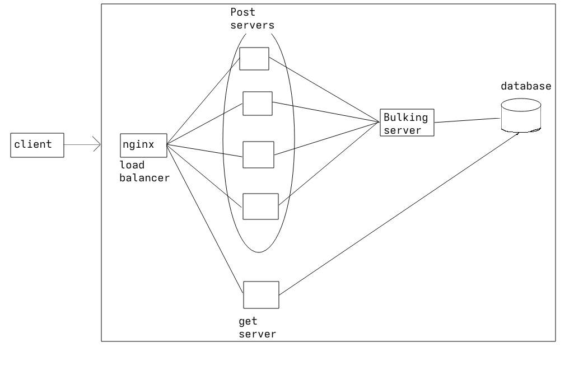

# Cloud Tests

A small distributed backend setup for testing a horizontally scaled service architecture using Docker, Nginx, gRPC, and PostgreSQL.

## Architecture

The system consists of:

* **Nginx** : entry point and load balancer for the HTTP requests.
* **Post servers** : four HTTP worker instances that handle requests.
* **Bulkers** : two gRPC services that sit between the workers and the database.
* **PostgreSQL** : stores the application data.
* **gRPC** : used for communication between the workers and bulkers.

The current setup looks roughly like this:


Nginx distributes requests across the four post-server instances. The workers are split between two bulker instances, which communicate with PostgreSQL over gRPC.

## gRPC

The gRPC interface is defined in [`database.proto`](./database.proto).

It contains services for:

* Server/database health checks
* Creating cars
* Adding and updating car locations

The generated Python gRPC files are also included in the repository.

## Database Schema
2 tables, location and car_info
location
    car_id
    car_long
    car_lat

car_info
    car_id
    owner

## Running

The complete setup can be started with Docker Compose:

```bash
docker compose up --build
```

Nginx exposes the application on:

```text
http://localhost:8000
```

The PostgreSQL data is stored in a Docker volume so it persists across container restarts.

## Purpose

This repository is primarily for experimenting with and testing a distributed service setup with multiple workers, load balancing, gRPC communication, and a shared PostgreSQL database.
