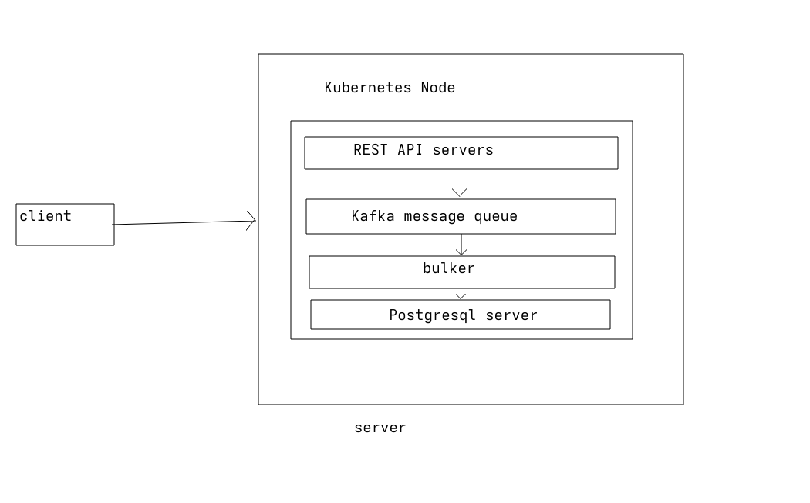
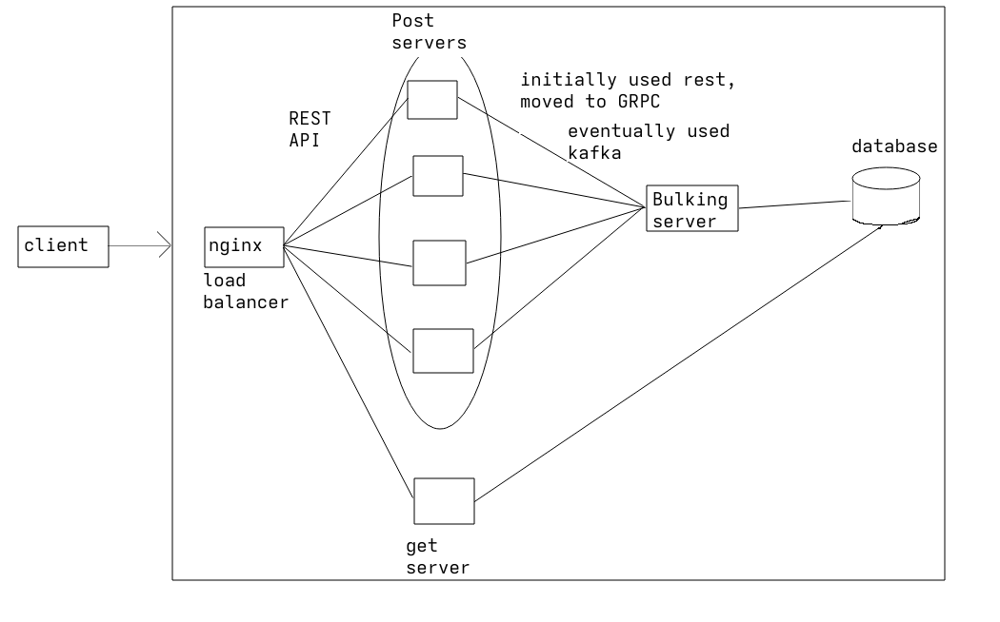

# Cloud Tests

A distributed backend setup for experimenting with **horizontal scaling, load balancing, gRPC, Kafka-based asynchronous processing, PostgreSQL, Docker, and Kubernetes**.

The project implements two different deployment approaches:

* **Docker Compose** — Nginx + 4 API servers + 2 bulkers + Kafka + PostgreSQL
* **Kubernetes** — 4 API server replicas + 2 bulker replicas + Kafka + PostgreSQL

The system is designed primarily for performance testing and studying how bottlenecks move between different layers of a distributed application.

## Results
current statistics(data output from driver.py):
```

========== RESULTS ==========
Concurrency:  50
Requests:     13405
Errors:       0
Duration:     5.020 sec
RPS:          2670.08
Latency avg:  18.651 ms
Latency p99:  27.990 ms

========== RESULTS ==========
Concurrency:  100
Requests:     13641
Errors:       0
Duration:     5.044 sec
RPS:          2704.28
Latency avg:  36.724 ms
Latency p99:  54.321 ms

========== RESULTS ==========
Concurrency:  150
Requests:     13183
Errors:       0
Duration:     5.064 sec
RPS:          2603.43
Latency avg:  57.147 ms
Latency p99:  91.000 ms

========== RESULTS ==========
Concurrency:  200
Requests:     11864
Errors:       0
Duration:     5.133 sec
RPS:          2311.17
Latency avg:  84.958 ms
Latency p99:  151.960 ms

========== RESULTS ==========
Concurrency:  250
Requests:     7717
Errors:       0
Duration:     5.162 sec
RPS:          1494.83
Latency avg:  164.035 ms
Latency p99:  264.265 ms
```

### Kubernetes



### Docker Compose(old)



## Components

### API Servers

The API layer consists of four server(post) instances and one server(get).

Each server exposes the FastAPI application on port `8001` and communicates with a bulker through kafka.

With Docker Compose, the workers are explicitly split between the two bulkers:

| Server          | Bulker     |
| --------------- | ---------- |
| `post-server-1` | `bulker-1` |
| `post-server-2` | `bulker-1` |
| `post-server-3` | `bulker-2` |
| `post-server-4` | `bulker-2` |

In Kubernetes, the servers connect to `bulker-service:50051`, with Kubernetes distributing connections across the bulker pods.

### Bulkers

Two bulker instances bulk up the database writes
The bulker collects messages into batches using two limits:

```text
BATCH_SIZE = 1000
FLUSH_INTERVAL = 30 ms
```

A batch is therefore processed when either:

* 1000 messages have been collected, or
* approximately 30 ms have elapsed after receiving the first message.

Other functionality
* Runs a gRPC server on port `50051` (only for compatibility)
* Maintains a PostgreSQL connection pool
* Consumes messages from Kafka
* Batches location updates
* Writes batches to PostgreSQL

### Kafka

Kafka is used to save the data and maintain server working.

The topic used for location updates is:

```text
post-handler
```

The current Kafka configuration uses:

```text
1 partition
```

Kafka runs in KRaft mode as a single broker/controller.

### PostgreSQL

PostgreSQL stores two application tables:

```text
car_info
location
```

The logical schema is:

```text
car_info
---------
car_id
owner

location
--------
car_id
car_long
car_lat
```

### HTTP API

The FastAPI server exposes the following endpoints.

#### Health check

```http
GET /
```

Response:

```json
{
    "message": "API is running"
}
```

#### Get all cars

```http
GET /cars
```

#### Get the last car

```http
GET /last
```

#### Add a car

```http
POST /addcars
```

Request:

```json
{
    "owner": "Alice"
}
```

#### Add a location

```http
POST /addlocation/{car_id}
```

Request:

```json
{
    "car_long": 72.57,
    "car_lat": 23.02
}
```

#### Get all locations

```http
GET /location
```

#### Get one car's location

```http
GET /location/{car_id}
```

#### Update a location

```http
PUT /location/{car_id}
```

Request:

```json
{
    "car_long": 72.57,
    "car_lat": 23.02
}
```

The location update is sent to Kafka and returns after the Kafka producer receives an acknowledgement.

The PostgreSQL update happens asynchronously in the bulker.


### HTTP serving

Nginx listens on:

```text
http://localhost:8000
```

Requests sent to port `8000` are distributed between the four API servers.

The Nginx configuration is:

## Custom Load Balancer

The repository also contains a Python/FastAPI load balancer, which didnt perform well and was replaced by nginx, and then later by kubernetes.

and forwards requests using an asynchronous `httpx` client.

The load balancer performs simple round-robin selection between discovered servers.

It is separate from the current Docker Compose Nginx configuration.

## Kubernetes

A Kubernetes version of the system is provided in:

```text
k8s-lab/
```

The manifests are intended to be used with **Kind** for local Kubernetes testing.


### Create a Kind cluster

The provided Kind configuration maps Kubernetes port `30000` to host port `8000`.

```bash
kind create cluster --config k8s-lab/kind-config.yaml
```

### Build the application images

Build the post server, bulker and get server image:

```bash
docker build -f server/Dockerfile.post -t my-server:local .
docker build -f bulker/Dockerfile -t my-bulker:local .
docker build -t my-get-server:local -f server/Dockerfile.get .
```
Load the images into Kind:

```bash
kind load docker-image my-server:local --name k8s-lab
kind load docker-image my-bulker:local --name k8s-lab
kind load docker-image my-get-server:local --name k8s-lab
```

### Deploy the stack

Apply PostgreSQL:

```bash
kubectl apply -f k8s-lab/postgres.yaml
kubectl apply -f k8s-lab/postgres-service.yaml
```

Apply Kafka:

```bash
kubectl apply -f k8s-lab/kafka.yaml
```

Apply the bulkers:

```bash
kubectl apply -f k8s-lab/bulker.yaml
kubectl apply -f k8s-lab/bulker-service.yaml
```

Apply the API servers:

```bash
kubectl apply -f k8s-lab/server.yaml
kubectl apply -f k8s-lab/server-service.yaml
```

Check the pods:

```bash
kubectl get pods
```

Check the services:

```bash
kubectl get services
```

The API server is exposed through the NodePort:

```text
http://localhost:8000
```

The Kubernetes service maps:

```text
host :8000
    ↓
NodePort :30000
    ↓
server-service
    ↓
server pods :8001
```

## Load Testing

The load-testing client is located at:

```text
driver/driver.py
```

It uses `aiohttp` to generate concurrent and asynchronous HTTP requests against:

```text
http://127.0.0.1:8000
```

The test performs `PUT /location/{car_id}` requests continuously for:

```text
5 seconds
```

for each concurrency level.

The current test levels are:

```text
50
100
150
200
250
```

Each worker repeatedly updates a deterministic car ID based on its worker ID and generates random latitude/longitude values.

### Metrics

The driver reports:

* Concurrency
* Completed requests
* Errors
* Test duration
* Requests per second
* Average latency
* p99 latency

It also contains support for database latency measurements, although the current HTTP response path does not populate `db_latencies`.

Run it with:

```bash
python driver/driver.py
```

The results are printed after each concurrency level.

Errors are appended to:

```text
driver/logs.txt
```

## Data Flow

### Location creation

`POST /addlocation/{car_id}` follows the synchronous path:

```text
HTTP
 ↓
API Server
 ↓
gRPC
 ↓
Bulker
 ↓
PostgreSQL
```

The request does not use Kafka.

### Location update

`PUT /location/{car_id}` follows the asynchronous path:

```text
HTTP
 ↓
API Server
 ↓
Kafka
 ↓
Bulker
 ↓
Batch
 ↓
PostgreSQL
```

The API server waits for Kafka to acknowledge the message, but does not wait for PostgreSQL to perform the update.

This separates request handling from database processing.

## Kafka Consumer Behavior

The bulkers use the same consumer group:

```text
processor
```

The current Kafka topic has only one partition.

Therefore, although two bulker instances are running, a single partition can only be actively consumed by one consumer in the group at a time.

Increasing the number of Kafka partitions would allow multiple consumers in the `processor` group to process partitions concurrently.

The producer also uses `car_id` as the Kafka message key:

```text
key = car_id
```

This allows messages for the same car to consistently map to the same partition when multiple partitions are configured.

## Purpose

This project is intended for fun

The main areas being explored are:

* Horizontal scaling
* HTTP load balancing
* gRPC
* Kafka
* Asynchronous processing
* Batch database writes
* PostgreSQL connection pooling
* Docker networking
* Kubernetes deployments
* Kafka consumer groups
* Concurrent request handling
* Latency and throughput benchmarking
* Identifying system bottlenecks as concurrency increases

The project provides both a containerized Docker environment and a Kubernetes environment so that the behavior of the same basic workload can be tested under different deployment models.

## Notes

The current Kafka deployment is intentionally a small single-node setup:

```text
1 broker
1 partition
1 controller
```

The Kubernetes PostgreSQL and Kafka deployments also use ephemeral Kubernetes storage (`emptyDir` for Kafka and no persistent volume for PostgreSQL), so the Kubernetes setup should be treated as a local testing environment rather than a production deployment.

The database credentials currently stored in the Compose and Kubernetes manifests are also intended only for local experimentation.

